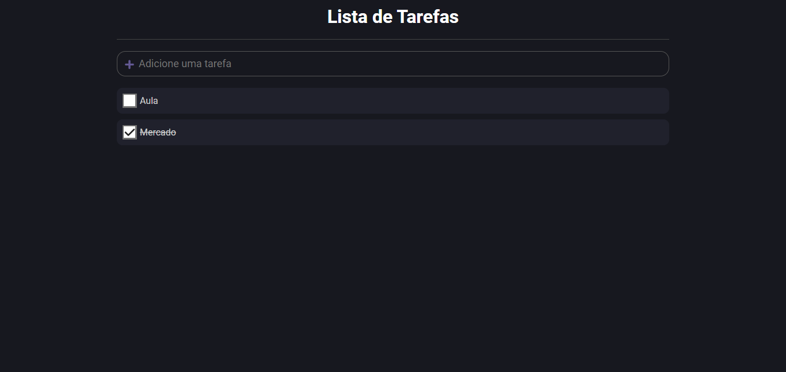

# To-do List 📝

#### Projeto criado pelo professor [Bonieky Lacerda](https://www.youtube.com/watch?v=95sAtAareR8), feito para praticar Typescript com React.

## Tecnologias

- [TypeScript](https://www.typescriptlang.org)
- [React](https://reactjs.org)
- [Styled Components](https://styled-components.com)
- [Vite](https://vitejs.dev)

